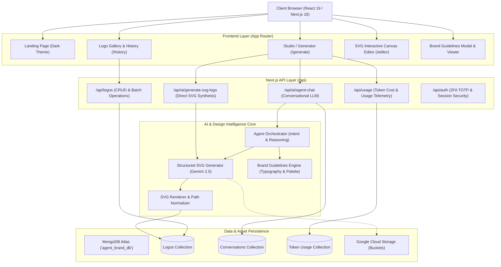
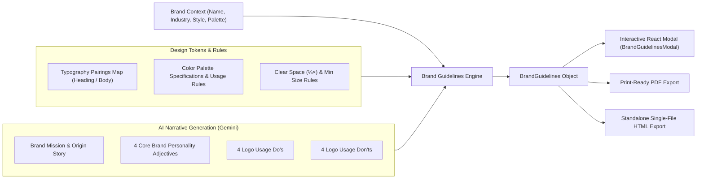
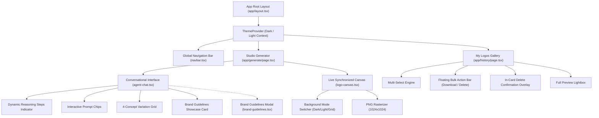
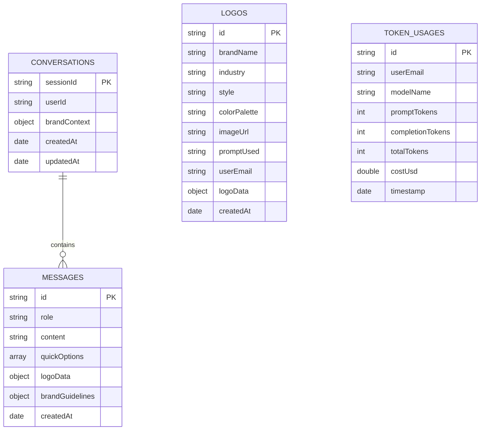

# Project Architecture & System Design

This document outlines the complete architectural blueprints, component interactions, data pipelines, and design systems powering the **LogoForge AI Brand Design Director** platform.

---

## 1. High-Level System Architecture

The application is built on a full-stack Next.js App Router architecture integrated with Google Cloud Platform Vertex AI (Gemini Models), MongoDB Atlas, and Google Cloud Storage.

---

## 2. AI Reasoning & SVG Synthesis Pipeline

The platform uses a two-stage generative design loop:

1. **Conversational Stage**: Analyzes client requirements, extracts brand parameters (name, industry, style, color palette), and manages conversation context.
2. **Deterministic SVG Generation Stage**: Generates structured vector JSON schemas and transforms them into clean, scalable SVG markup.

```mermaid
sequenceDiagram
    autonumber
    actor User as Client / User
    participant ChatUI as AgentChat UI
    participant Route as /api/ai/agent-chat
    participant Orch as AgentOrchestrator
    participant Gemini as Google Vertex AI (Gemini)
    participant SVG as Structured SVG Engine
    participant DB as MongoDB Atlas

    User->>ChatUI: Sends message ("Apex Labs, AI Infrastructure, 3D style")
    ChatUI->>Route: POST /api/ai/agent-chat (message, context, sessionId)
    Route->>Orch: processMessage(message, context)
    
    rect rgb(20, 25, 35)
        note over Orch,Gemini: Stage 1: Intent Analysis & Spec Gathering
        Orch->>Gemini: Prompt with current spec & conversation history
        Gemini-->>Orch: Structured JSON (assistantMessage, updatedContext, flags)
    end

    alt shouldGenerateLogo == true
        rect rgb(25, 35, 25)
            note over Orch,SVG: Stage 2: Multi-Concept SVG Generation
            Orch->>SVG: generateStructuredLogos(spec, count: 4)
            SVG->>Gemini: Request vector layer primitives (paths, text, colors)
            Gemini-->>SVG: 4 Distinct LogoData concept objects
            SVG->>DB: Save 4 concepts to logos collection
            DB-->>SVG: Saved logo IDs & metadata
        end
    end

    alt shouldGenerateGuidelines == true
        rect rgb(35, 30, 20)
            note over Orch,Gemini: Stage 3: Brand Guidelines Formulation
            Orch->>Gemini: Synthesize Brand Story, Personality Traits, Do's & Don'ts
            Gemini-->>Orch: Narrative Copy
            Orch->>Orch: Combine with deterministic typography & palette rules
        end
    end

    Orch->>DB: Append conversation turn (userMessage, assistantMessage, logoIds)
    Orch-->>Route: Return orchestration result
    Route-->>ChatUI: Display dynamic response, Concept variations, or Guidelines Card
    ChatUI-->>User: Interactive visual preview & options
```

---

## 3. Brand Guidelines & Identity System Architecture

The Brand Guidelines system produces exportable corporate identity books with fixed typographic hierarchy, accessibility checks, and dynamic mark rendering.

---

## 4. Frontend Component Hierarchy

The interface is divided into modular, stateful components that synchronize through reactive callbacks:

---

## 5. Database Schema & Data Models

The system persists data using **MongoDB Atlas** across three primary collections:

---

## 6. Security, Deployment & Infrastructure

- **Authentication**: Stateless session handling with optional TOTP-based Two-Factor Authentication.
- **Cloud Build & Deployment**: Automated container builds deployed to **Google Cloud Run**.
- **Asset Storage**: Scalable cloud storage for exported brand assets, logos, and vector assets.
- **Environment Isolation**: Production and development configurations separated through environment variables.
