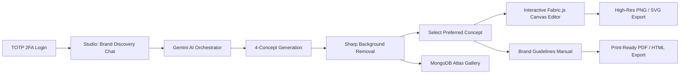

# AI Brand Design Director (LogoForge AI)

[](https://nextjs.org/)
[](https://react.dev/)
[](https://www.typescriptlang.org/)
[](https://cloud.google.com/vertex-ai)
[](https://www.mongodb.com/)
[](http://fabricjs.com/)
[](https://tailwindcss.com/)
[](LICENSE)

An autonomous, full-stack **AI Brand & Logo Design Director** web application. LogoForge pairs multi-turn conversational AI reasoning with multi-concept logo synthesis, automated background stripping, a professional vector canvas editor, and complete brand identity guideline generation.

---

## ⚡ Key Features

### 🤖 1. Autonomous AI Brand Design Director
- **Conversational Brand Discovery**: Natural conversational agent powered by Google Gemini (Gemini 2.5 / 3.7 Flash) that interviews founders, extracts brand attributes, and structures design parameters (style, industry, color palette, symbology, slogan).
- **Multi-Concept Synthesis**: Generates **4 distinct logo concept variations** simultaneously using Google Imagen / Gemini image models for every prompt cycle.
- **Iterative Refinement & Quick Actions**: Context-aware suggested prompts (e.g., *"Make it 3D isometric"*, *"Make it ultra minimalist"*, *"Incorporate neon tones"*) and feedback loops.
- **Dynamic Reasoning Indicators**: Live action feedback during prompt engineering, asset synthesis, and persistence.

### 🎨 2. Professional Vector Canvas Studio (Fabric.js v7)
- **Vector Shape Library**: 23+ parametric shapes (Squares, Circles, Diamonds, Polygons, Stars, Hearts, Badges, Speech Bubbles, Frames, Lines, Dashed Lines) with customizable fill, stroke, and opacity.
- **Freehand Drawing Engine**: Pencil, Spray, and Circle brushes with adjustable smoothing, size, opacity, and soft shadow glow effects.
- **Typography & Font Management**: Full text hierarchy (Heading, Subheading, Body) with curated Google Fonts, character spacing, line height, and text alignment.
- **Smart Alignment & Guides**: Canva-style center-snapping with dynamic magnetic guides during object dragging.
- **Layer & Hierarchy Management**: Bring forward, send to back, duplicate, lock/unlock, hide/show, group/ungroup, and reorder objects.
- **Image Filters & Color Grading**: Live non-destructive adjustments for Brightness, Contrast, Saturation, Hue, Blur, Grayscale, Invert, and Sepia.
- **Preset Canvas Sizes**: One-click sizing for Logo (500×500), Social Square (1080×1080), Story (1080×1920), Banner (1500×500), HD (1280×720), and Full HD (1920×1080) plus custom dimensions.
- **Project Save & State History**: 60-level Undo/Redo history stack, Zoom (10%–400%) with Ctrl+Wheel support, and Canvas JSON project export/import.

### 📖 3. Complete Brand Guidelines Manual (PDF & HTML Export)
- **Deterministic 6-Section Identity Kit**:
  1. **Brand Story & Narrative**: AI-crafted core brand mission and conceptual narrative.
  2. **Brand Personality Matrix**: 4 core brand traits and emotional attributes.
  3. **Curated Color Palette**: Primary, Secondary, Accent, Dark Neutral, and Light Neutral swatches with exact HEX, RGB values, and usage guidelines.
  4. **Typography Pairings**: Heading and body typeface recommendations with typographic hierarchy.
  5. **Logo Usage Rules**: Clear Do's (correct applications) and Don'ts (misuse guidelines).
  6. **Asset Mockups & Sizing Specs**: High-res logo display and clearspace minimum sizing.
- **Export Options**: Standalone self-contained HTML file download or print-ready PDF generated directly in browser.

### 🪄 4. Automated Background Stripping
- Integrated **Sharp** image processing automatically detects and removes opaque background fills from generated images, delivering clean transparent logo marks directly to the canvas editor.

### 💬 5. ChatGPT-Style Persistent Chat History
- Collapsible sidebar showing previous design sessions.
- Real-time search across conversations, inline conversation renaming, and one-click deletion.
- Full context and logo history restored automatically when switching between sessions.

### 🍃 6. MongoDB Atlas Database Integration
- Complete data persistence for generated logos, master prompts, color palettes, conversation trees, and 2FA secrets via Mongoose models.

### 🔐 7. Passwordless TOTP 2FA Authentication
- Time-based One-Time Password (RFC 6238 TOTP) authentication with Google Authenticator QR code setup (`otplib` + `qrcode`) and secure NextAuth session management.

### 🖤 8. Ultra-Modern Monochrome UI
- Minimalist dark aesthetic engineered with Tailwind CSS v4, Framer Motion spring micro-animations, and Lucide icons.

---

## 🛠️ Technology Stack

| Layer | Technologies |
| :--- | :--- |
| **Framework** | [Next.js 16 (App Router)](https://nextjs.org/) &bull; [React 19](https://react.dev/) |
| **Language** | [TypeScript 5](https://www.typescriptlang.org/) |
| **AI Models & SDK** | [@google/genai](https://www.npmjs.com/package/@google/genai) (Gemini 2.5/3.7 Flash & Imagen / Gemini Image via Google Cloud Vertex AI or Google AI Studio) |
| **Image Processing** | [Sharp](https://sharp.pixelplumbing.com/) |
| **Canvas Engine** | [Fabric.js v7](http://fabricjs.com/) |
| **Database & ORM** | [MongoDB Atlas](https://www.mongodb.com/atlas) &bull; [Mongoose v9](https://mongoosejs.com/) |
| **Authentication** | [NextAuth.js v4](https://next-auth.js.org/) &bull; [otplib](https://github.com/yeojinj/otplib) &bull; [qrcode](https://github.com/soldair/node-qrcode) |
| **Styling & Icons** | [Tailwind CSS v4](https://tailwindcss.com/) &bull; [Lucide React](https://lucide.dev/) |
| **Motion & Animation** | [Framer Motion v13](https://www.framer.com/motion/) |
| **Validation** | [Zod](https://zod.dev/) |

---

## 📁 Architecture Overview

```
logo-genrator/
├── public/                                # Static assets and icons
├── src/
│   ├── app/
│   │   ├── api/
│   │   │   ├── ai/
│   │   │   │   ├── agent-chat/route.ts    # Gemini conversational reasoning & multi-concept generation
│   │   │   │   └── generate-logo/route.ts # Direct logo synthesis endpoint
│   │   │   ├── auth/
│   │   │   │   ├── [...nextauth]/route.ts # NextAuth credentials provider
│   │   │   │   └── totp/setup/route.ts    # Google Authenticator TOTP setup & QR generator
│   │   │   ├── health/route.ts            # Service health check endpoint
│   │   │   └── logos/route.ts             # MongoDB Atlas logo CRUD endpoints
│   │   ├── generate/page.tsx              # Studio: Sidebar + Agent Chat + Canvas Editor + Brand Guidelines
│   │   ├── history/page.tsx               # My Logos gallery with search, sorting, and inspector modal
│   │   ├── login/page.tsx                 # Auth redirect handler
│   │   ├── globals.css                    # Global styling & Tailwind directives
│   │   ├── layout.tsx                     # Root layout with SessionProvider
│   │   └── page.tsx                       # Landing page with interactive TOTP 2FA login
│   │
│   ├── components/
│   │   ├── brand-kit/
│   │   │   └── brand-guidelines.tsx       # Brand guidelines visual document & actions (PDF/HTML)
│   │   ├── canvas-editor/
│   │   │   ├── editor-utils.ts            # Shape library, fonts, color swatches, canvas presets
│   │   │   └── logo-editor.tsx            # Full-featured Fabric.js interactive canvas editor
│   │   ├── layout/
│   │   │   ├── navbar.tsx                 # Minimal top navigation bar
│   │   │   └── footer.tsx                 # Clean minimalist footer
│   │   ├── logo-generator/
│   │   │   ├── agent-chat.tsx             # Interactive Brand Architect conversational UI
│   │   │   ├── chat-sidebar.tsx           # ChatGPT-style conversation session manager
│   │   │   ├── logo-canvas.tsx            # Live logo preview & inspector
│   │   │   └── prompt-form.tsx            # Quick preset prompt bar
│   │   ├── providers/
│   │   │   └── session-provider.tsx       # NextAuth client session provider
│   │   └── ui/                            # Button, Card, Badge primitives
│   │
│   ├── config/
│   │   ├── brand-kit.ts                   # Deterministic brand tokens, type pairings & color palettes
│   │   ├── logo-presets.ts                # Visual style templates and preset prompts
│   │   ├── palettes.ts                    # Color swatches and theme configurations
│   │   └── site.ts                        # Site metadata configuration
│   │
│   ├── lib/
│   │   ├── ai/
│   │   │   ├── agent-orchestrator.ts      # Core conversational reasoning loop & multi-concept coordinator
│   │   │   ├── brand-guidelines.ts        # Brand guidelines generator (narrative LLM + deterministic tokens)
│   │   │   ├── gemini.ts                  # Google GenAI SDK client (Vertex AI ADC & API Key support)
│   │   │   ├── prompts.ts                 # Master prompt engineering templates
│   │   │   ├── service.ts                 # AI service abstraction layer
│   │   │   └── strip-background.ts        # Sharp-powered background transparency processor
│   │   ├── auth/
│   │   │   ├── auth-options.ts            # NextAuth configuration with TOTP verification
│   │   │   └── totp.ts                    # RFC 6238 TOTP generation & verification
│   │   ├── db/
│   │   │   ├── client.ts                  # MongoDB Atlas connection singleton
│   │   │   └── models/                    # Mongoose schemas (Conversation, Logo, TOTP Secret)
│   │   ├── brand-guidelines-html.ts       # Standalone HTML/PDF document generator
│   │   ├── env.ts                         # Environment variable validator
│   │   └── utils.ts                       # Class names & formatting utilities
│   │
│   ├── services/
│   │   ├── conversation.service.ts        # MongoDB conversation repository layer
│   │   └── logo.service.ts                # MongoDB logo repository layer
│   │
│   ├── types/                             # TypeScript interfaces (AI, Brand, Chat, Logo, API)
│   └── validators/                        # Zod schemas for input validation
│
├── .env.example                           # Environment configuration template
├── next.config.ts
├── package.json
└── tsconfig.json
```

---

## 🚀 Getting Started

### Prerequisites

Ensure you have the following installed:
- **Node.js**: `v18.18.0` or higher (Node.js 20+ recommended)
- **npm** or **pnpm** / **yarn**
- **MongoDB Atlas** database URI (or a local MongoDB instance)
- **Google Cloud Vertex AI** setup (Application Default Credentials) **OR** a **Google AI Studio API Key**

---

### Step 1: Clone the Repository

```bash
git clone https://github.com/mangeshi-cbmo/AI-Brand-Design-Director.git
cd AI-Brand-Design-Director
```

---

### Step 2: Install Dependencies

```bash
npm install
```

---

### Step 3: Configure Environment Variables

Create a `.env.local` file by copying the template:

```bash
cp .env.example .env.local
```

Configure your environment variables in `.env.local`:

```env
# Application Environment
NODE_ENV=development
NEXTAUTH_URL=http://localhost:3000
NEXTAUTH_SECRET=your_secure_random_secret_string

# MongoDB Atlas Database
MONGODB_URI=mongodb+srv://<username>:<password>@<cluster>.mongodb.net/logo?retryWrites=true&w=majority
DATABASE_URL=mongodb+srv://<username>:<password>@<cluster>.mongodb.net/logo?retryWrites=true&w=majority
MONGODB_DB=logo

# AI Provider: Google Gemini via Vertex AI (Option A - Recommended for Cloud)
AI_PROVIDER=gemini
GOOGLE_GENAI_USE_VERTEXAI=true
GOOGLE_CLOUD_PROJECT=your-gcp-project-id
GOOGLE_CLOUD_LOCATION=global
GEMINI_IMAGE_LOCATION=global
GEMINI_TEXT_MODEL=gemini-3.7-flash
GEMINI_IMAGE_MODEL=gemini-3.1-flash-image

# AI Provider: Google AI Studio API Key (Option B - Alternative)
# If using an API key directly, set GOOGLE_GENAI_USE_VERTEXAI=false and supply your key:
# GEMINI_API_KEY=your_gemini_api_key_from_ai_studio
```

> [!TIP]
> **Authentication Setup for Vertex AI**: If using Google Cloud Vertex AI, run:
> ```bash
> gcloud auth application-default login
> ```
> Or supply a service account key using `GOOGLE_APPLICATION_CREDENTIALS`.

---

### Step 4: Run the Development Server

```bash
npm run dev
```

Open [http://localhost:3000](http://localhost:3000) in your browser.

---

### Step 5: Build for Production

To validate and create an optimized production build:

```bash
npm run build
npm run start
```

---

## 🔑 Environment Variables Reference

| Variable | Required | Default | Description |
| :--- | :---: | :--- | :--- |
| `NODE_ENV` | Yes | `development` | Environment mode (`development` or `production`). |
| `NEXTAUTH_URL` | Yes | `http://localhost:3000` | Canonical root URL of the application. |
| `NEXTAUTH_SECRET` | Yes | &mdash; | Secret key used to encrypt NextAuth JWT tokens and cookies. |
| `MONGODB_URI` | Yes | &mdash; | MongoDB Atlas connection connection string. |
| `MONGODB_DB` | No | `logo` | Target MongoDB database name. |
| `AI_PROVIDER` | No | `gemini` | Primary AI provider name (`gemini`). |
| `GOOGLE_GENAI_USE_VERTEXAI`| No | `true` | When `true`, authenticates with Vertex AI using ADC or GCP credentials. |
| `GOOGLE_CLOUD_PROJECT` | Conditional | &mdash; | GCP Project ID (required when Vertex AI is enabled). |
| `GOOGLE_CLOUD_LOCATION`| No | `global` | Vertex AI compute location for text generation. |
| `GEMINI_IMAGE_LOCATION`| No | `global` | Vertex AI compute location for image generation. |
| `GEMINI_TEXT_MODEL` | No | `gemini-3.7-flash` | Gemini model for conversational reasoning and brand copy. |
| `GEMINI_IMAGE_MODEL`| No | `gemini-3.1-flash-image`| Model for logo concept image generation. |
| `GEMINI_API_KEY` | Conditional | &mdash; | API Key from Google AI Studio (if not using Vertex AI ADC). |

---

## 📡 API Route Reference

| Method | Endpoint | Description |
| :--- | :--- | :--- |
| `POST` | `/api/ai/agent-chat` | Sends user message and brand context to Gemini Agent; triggers 4-concept logo generation & brand guidelines synthesis; saves conversation turn to MongoDB. |
| `GET` | `/api/ai/agent-chat` | Retrieves user's saved conversation history sessions or loads a specific session by `sessionId`. |
| `PATCH` | `/api/ai/agent-chat` | Renames an existing chat session. |
| `DELETE` | `/api/ai/agent-chat` | Deletes a conversation session by `sessionId`. |
| `POST` | `/api/ai/generate-logo`| Direct endpoint for single logo synthesis and background stripping. |
| `POST` | `/api/auth/totp/setup` | Generates a new RFC 6238 TOTP secret and QR code Data URL for Google Authenticator. |
| `POST` | `/api/auth/[...nextauth]` | NextAuth authentication handler verifying TOTP 6-digit verification code. |
| `GET` | `/api/logos` | Fetches saved logos for the authenticated user from MongoDB Atlas. |
| `POST` | `/api/logos` | Persists a new logo and its design metadata to MongoDB Atlas. |
| `DELETE` | `/api/logos` | Deletes a saved logo by ID. |
| `GET` | `/api/health` | Health check endpoint returning database and runtime status. |

---

## 🎯 User Workflow



1. **Authentication**: Enter your email address on the landing page, scan the generated QR code in Google Authenticator (or enter the TOTP secret key), and submit the 6-digit rolling code.
2. **Brand Discovery**: Converse with the AI Brand Architect. Define your company name, industry, preferred style, and color vibe.
3. **Concept Generation**: The agent crafts 4 distinct logo concept marks with clean transparent backgrounds, paired with a complete 6-section brand guidelines kit.
4. **Customization in Canvas**: Open any concept in the Fabric.js studio to add typography, shapes, custom colors, layer effects, or image filters.
5. **Brand Kit & Export**: View and customize the brand manual, download high-res PNG/SVG assets, or export the full brand guidelines as a PDF/HTML document.
6. **Gallery & History**: Access previously generated assets anytime from the **History** gallery, with instant search, sorting, and inspector controls.

---

## 📄 License

This project is licensed under the MIT License — see the [LICENSE](LICENSE) file for details.

&copy; 2026 **LogoForge AI** &bull; Autonomous Brand Design Director.
